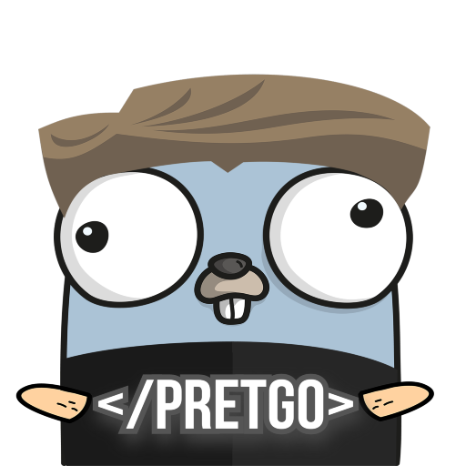

<h3 align="center">Redesign in progress</h3>
<!-- PROJECT SHIELDS -->
[![Contributors][contributors-shield]][contributors-url]
[![Forks][forks-shield]][forks-url]
[![Stargazers][stars-shield]][stars-url]
[![Issues][issues-shield]][issues-url]
[![MIT License][license-shield]][license-url]
[![LinkedIn][linkedin-shield]][linkedin-url]

<!-- PROJECT LOGO -->
<br />
<div align="center">
  <a href="https://github.com/muratmirgun/pretgo">
    
  </a>

<h3 align="center">PRETGO</h3>

  <p align="center">
    Command Line Pretty Print Build with Golang
    <br />
    <a href="https://github.com/muratmirgun/pretgo"><strong>Explore the docs »</strong></a>
    <br />
    <br />

    <a href="https://github.com/muratmirgun/pretgo/issues">Report Bug</a>
    ·
    <a href="https://github.com/muratmirgun/pretgo/issues">Request Feature</a>
  </p>
</div>


<!-- TABLE OF CONTENTS -->
<details>
  <summary>Table of Contents</summary>
  <ol>
    <li>
      <a href="#about-the-project">About The Project</a>
    </li>
    <li>
      <a href="#getting-started">Getting Started</a>
      <ul>
        <li><a href="#installation">Installation</a></li>
      </ul>
    </li>
    <li><a href="#usage">Usage</a></li>
    <li><a href="#roadmap">Roadmap</a></li>
    <li><a href="#contributing">Contributing</a></li>
    <li><a href="#license">License</a></li>
    <li><a href="#contact">Contact</a></li>
  </ol>
</details>


<!-- ABOUT THE PROJECT -->
## About The Project

> A very simple CLI for Json, Html, Yaml and ml format! And now it also works with Http Requests!

<p align="right">(<a href="#readme-top">back to top</a>)</p>


<!-- GETTING STARTED -->
## Getting Started

This is an example of how you may give instructions on setting up your project locally.
To get a local copy up and running follow these simple example steps.


### Installation

1. Install the cli with Go Install:
   ```sh
   go install github.com/muratmirgun/pretgo@latest
   ```

<p align="right">(<a href="#readme-top">back to top</a>)</p>


<!-- USAGE EXAMPLES -->
## Usage

For basic usage examples, run the following commands:

```sh
$ pretgo --help
```

Example for json type
```sh
$ cat mess.json | pretgo json
```
or

```sh
$  pretgo json file mess.json
```


<p align="right">(<a href="#readme-top">back to top</a>)</p>


<!-- ROADMAP -->
## Roadmap

- [x] Json Pretty Print
- [x] Xml Pretty Print
- [x] Html Pretty Print
- [x] Yaml Pretty Print
- [ ] Handle Requests and Pretty Print

See the [open issues](https://github.com/muratmirgun/pretgo/issues) for a full list of proposed features (and known issues).

<p align="right">(<a href="#readme-top">back to top</a>)</p>


<!-- CONTRIBUTING -->
## Contributing

Contributions are what make the open source community such an amazing place to learn, inspire, and create. Any contributions you make are **greatly appreciated**.

If you have a suggestion that would make this better, please fork the repo and create a pull request. You can also simply open an issue with the tag "enhancement".
Don't forget to give the project a star! Thanks again!

1. Fork the Project
2. Create your Feature Branch (`git checkout -b feature/AmazingFeature`)
3. Commit your Changes (`git commit -m 'Add some AmazingFeature'`)
4. Push to the Branch (`git push origin feature/AmazingFeature`)
5. Open a Pull Request

<p align="right">(<a href="#readme-top">back to top</a>)</p>


<!-- LICENSE -->
## License

Distributed under the MIT License. See `LICENSE.txt` for more information.

<p align="right">(<a href="#readme-top">back to top</a>)</p>


<!-- CONTACT -->
## Contact

Murat Mirgun Ercan - [@muratmirgun](https://twitter.com/muratmirgun) - muratmirgunercan@gmail.com

Project Link: [https://github.com/muratmirgun/pretgo](https://github.com/muratmirgun/pretgo)

<p align="right">(<a href="#readme-top">back to top</a>)</p>


<!-- MARKDOWN LINKS & IMAGES -->
<!-- https://www.markdownguide.org/basic-syntax/#reference-style-links -->
[contributors-shield]: https://img.shields.io/github/contributors/muratmirgun/pretgo.svg?style=for-the-badge
[contributors-url]: https://github.com/muratmirgun/pretgo/graphs/contributors
[forks-shield]: https://img.shields.io/github/forks/muratmirgun/pretgo.svg?style=for-the-badge
[forks-url]: https://github.com/muratmirgun/pretgo/network/members
[stars-shield]: https://img.shields.io/github/stars/muratmirgun/pretgo.svg?style=for-the-badge
[stars-url]: https://github.com/muratmirgun/pretgo/stargazers
[issues-shield]: https://img.shields.io/github/issues/muratmirgun/pretgo.svg?style=for-the-badge
[issues-url]: https://github.com/muratmirgun/pretgo/issues
[license-shield]: https://img.shields.io/github/license/muratmirgun/pretgo.svg?style=for-the-badge
[license-url]: https://github.com/muratmirgun/pretgo/blob/master/LICENSE.txt
[linkedin-shield]: https://img.shields.io/badge/-LinkedIn-black.svg?style=for-the-badge&logo=linkedin&colorB=555
[linkedin-url]: https://linkedin.com/in/murat-m-ercan
[product-screenshot]: images/screenshot.png
