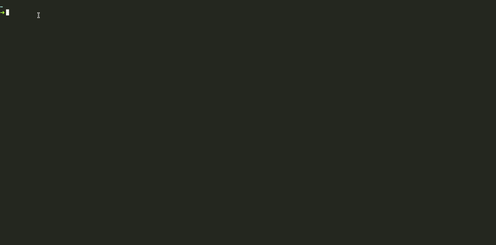

# PretGO

> So basic cli for format json,html and xml!

[![Contributors][contributors-shield]][contributors-url]
[![Forks][forks-shield]][forks-url]
[![Stargazers][stars-shield]][stars-url]
[![Issues][issues-shield]][issues-url]
[![MIT License][license-shield]][license-url]

## Table of contents

* [Screenshots](#screenshots)
* [Setup](#setup)
* [Status](#status)
* [Contact](#contact)

## Screenshots



## Setup

### First clone project

```bash
git clone https://github.com/muratmirgun/pretgo
```

### And install it

```bash
go install
```

## Code Examples

### Basic HTML format usage  

```bash
➜ pretgo phtml wrap=80 <old.html >new.html
```

### Basic Json format usage

```bash
➜ cat mes.json | pretgo pjson
```

### Basic XML format usage

```bash
➜ cat mes.xml | pretgo pxml
```

## Status

Project is: _in progress_ .

## Contact

Created by [@muratmirgun](https://twitter.com/muratmirgun) - feel free to contact me!

[contributors-shield]: https://img.shields.io/github/contributors/muratmirgun/pretgo.svg?style=for-the-badge
[contributors-url]: https://github.com/muratmirgun/pretgo/graphs/contributors
[forks-shield]: https://img.shields.io/github/forks/muratmirgun/pretgo.svg?style=for-the-badge
[forks-url]: https://github.com/muratmirgun/pretgo/network/members
[stars-shield]: https://img.shields.io/github/stars/muratmirgun/pretgo.svg?style=for-the-badge
[stars-url]: https://github.com/muratmirgun/pretgo/stargazers
[issues-shield]: https://img.shields.io/github/issues/muratmirgun/pretgo.svg?style=for-the-badge
[issues-url]: https://github.com/muratmirgun/pretgo/issues
[license-shield]: https://img.shields.io/github/license/muratmirgun/pretgo.svg?style=for-the-badge
[license-url]: https://github.com/muratmirgun/pretgo/blob/main/LICENSE
